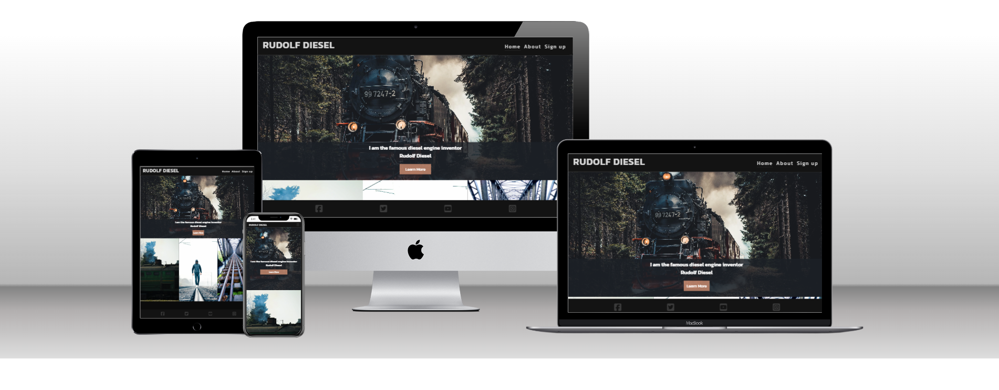
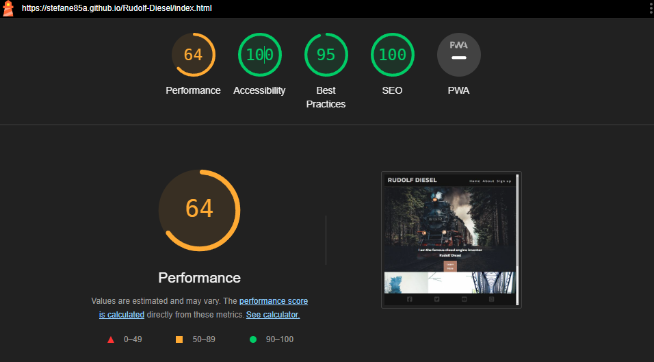

#

# Rudolf Diesel: The Man Behind a Revolution

## <u>About this Project</u>

Welcome to the Readme of a dedicated website to exploring the life and legacy of Rudolf Diesel,
the renowned inventor of the diesel engine. This website aims to provide a minor
overview of Diesel's contributions to mechanical engineering and the impact of his
innovations on industrial and transportation sectors.

This is a project at Code Institute and serves as an informative resource for those interested
in the history of engineering and industrial innovation. By diving into Diesel's life and work,
I aim to provide an understanding of the man behind a key technological advancement
that continues to play a vital role in our world.

# <U>Key Features</U>

### <u>Navigation Bar</u>

- **Home**: The landing page for the website.
- **About**: A page that decsribes Rudolf Diesels life.
- **Sign up**: A page for users to request news-letters.
- Menu turns into a bar-icon in mobile-view.

### <u>Engaging Footer</u>

The footer offers hover-effects and links to the organization's social media profiles, ensuring users can stay updated on news and developments related to Rudolf Diesel.

### <u>Sign-Up Form</u>

Users can subscribe to receive updates and newsletters about Rudolf Diesel.

# <u>Tests of the websites code</u>

- **HTML**: The website passes the official W3C validator with no errors.
- **CSS**: It also passes the official (Jigsaw) validator, free from errors.

* HTML

- [Home/Index](https://validator.w3.org/nu/?doc=https%3A%2F%2Fstefane85a.github.io%2FRudolf-Diesel%2Findex.html)
- [About](https://validator.w3.org/nu/?doc=https%3A%2F%2Fstefane85a.github.io%2FRudolf-Diesel%2Fabout.html)
- [Sign Up](https://validator.w3.org/nu/?doc=https%3A%2F%2Fstefane85a.github.io%2FRudolf-Diesel%2Fsignup.html)

* CSS

- [Style.css](https://jigsaw.w3.org/css-validator/validator?uri=https%3A%2F%2Fstefane85a.github.io%2FRudolf-Diesel%2Fassets%2Fcss%2Fstyle.css&profile=css3svg&usermedium=all&warning=1&vextwarning=&lang=sv)

    

- The perfomance-score could be heigher with smaller images.

## <u>Deployment Process</u>

The website is hosted on GitHub Pages, with deployment accomplished through the following steps:

1. Within the GitHub repository, access the **Settings** tab.
2. From the source section drop-down menu, select the **Master Branch**.
3. Once the master branch is selected, the page will automatically refresh, signifying a successful deployment.

You can explore the live site by clicking on the following links:

- [Rudolf Diesels Website](https://stefane85a.github.io/Rudolf-Diesel/index.html)
- [About](https://stefane85a.github.io/Rudolf-Diesel/about.html)
- [Sign Up](https://stefane85a.github.io/Rudolf-Diesel/signup.html)

# <u>Tests Made</u>

## Tested Devices
- Galaxy fold
- Galaxy S23
- Ipad
- Lenovo Legion Laptop

## Tested Browsers
- Chrome
- Mozilla Firefox
- Microsoft Edge

## Bugs not fixed

- Sign up button background changes width and is not center on galaxy-fold.
- Mediascreen needs improvement so site functions shows correctly.

## Future Enhancements

- Fix sign up button or replace from index-page.
- Replace image-sizes to smaller ones to make better perfomance-score.
- Adjust colors overall if needed.
- Create a better favicon.

# <u>Credits</u>

### The Content

- The content for the About page has been adapted from a [Wikipedia article](https://en.wikipedia.org/wiki/Rudolf_Diesel#Early_life_and_education) about Rudolf Diesel.
- I had guidance to implement the form of validation on the "Sign up page", responsive menu, footer and hero-image from [Code institute](https://codeinstitute.net/ie/) videos.
- Icons featured in the footer are sourced from [Fontawesome](https://fontawesome.com/start).
- The gallery images and "Learn More" -button is adapted from [W3Schools](https://www.w3schools.com).
- Fonts featured in the text are sourced from [Google](https://fonts.google.com/).
- Favicon is sourced from [Flaticon](https://www.flaticon.com/free-icon/engine_5366543), adapted in PS6 with colors and sizes.

### The Media

The images used on the home and about pages are credited to the following talented photographers on [Pexels](https://www.pexels.com/) .
 
- [Chinmay-Singh](https://www.pexels.com/sv-se/@chinmay-singh-251922/)

- [Ren Lavsad](https://www.pexels.com/sv-se/@ren-lavsad-379156630/)

- [Mark Plötz](https://www.pexels.com/sv-se/@markp/)

- [HH](https://www.pexels.com/sv-se/@h-h-227297/)

The images used on the about page are sourced from Wikipedia.

- [Wikipedia - Rudolf Diesel](https://commons.wikimedia.org/wiki/File:Rudolf_Diesel2.jpg)

- [Wikipedia - Diesel Engine](https://commons.wikimedia.org/wiki/File:Diselmotor,_Genomsk%C3%A4rning,_Nordisk_familjebok.png)